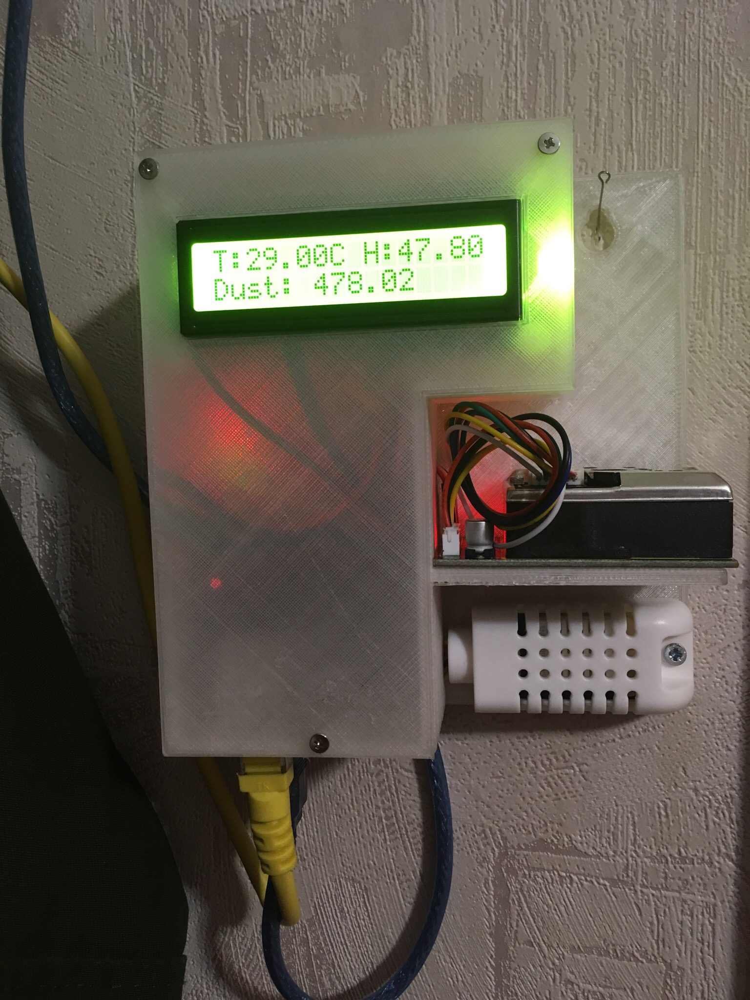

"Что бы ты не делал на ардуино, у тебя получится либо градусник, либо часы (с градусником)"

Проект электронного градусника, с доступом по сети и контролем уровня пыли. Ну и дисплечиком для ясности.
Работает на ардуино-уно c интернет-шилдом.

